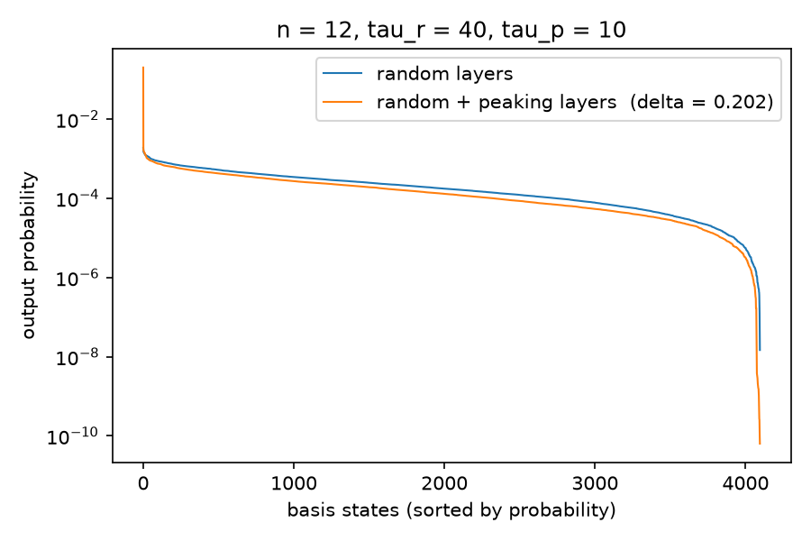

# Peaked circuits — reproducing Aaronson & Zhang, arXiv:2404.14493 (Section 3)

[](https://github.com/Ilyes-Jamoussi/peaked-circuits-pennylane/actions/workflows/tests.yml)
[](https://arxiv.org/abs/2404.14493)


A [PennyLane](https://pennylane.ai) reproduction of the numerical experiment in
[*On verifiable quantum advantage with peaked circuit sampling*](https://arxiv.org/abs/2404.14493)
(Aaronson & Zhang, 2024), Section 3: turning a random quantum circuit into a
**peaked** circuit — one whose output distribution concentrates on a single
basis state — by appending a small number of optimized layers. Peaked circuits
are a candidate for *verifiable* quantum advantage: the heavy output string
lets a classical challenger check the result of a sampling experiment.



*The signature result (cf. Fig. 2c of the paper): after appending and
optimizing τ_p = 10 peaking layers, the output distribution is unchanged in
bulk, but the probability of the peaked string is boosted by three orders of
magnitude.*

## Results

Paper configuration `n = 12, τ_r = 40, τ_p = 10` — the paper reports
**δ ≈ 0.2** on average over 100 circuit instances (Fig. 2c/2d):

| circuit                          | peak weight δ           |
| -------------------------------- | ----------------------- |
| random section alone             | 1.85 × 10⁻⁴  (≈ 1/2¹²)  |
| after optimizing the τ_p layers  | **0.2024**              |

Best of 3 independently initialized runs (0.2022 / 0.1981 / 0.2024), each
stopped by the convergence criterion. Reproduce this table and the figure
above with:

```bash
python peaked_circuits.py --output results/best.npz   # ~33 min on an Apple M-series laptop
python plot_distribution.py results/best.npz          # needs matplotlib
```

Every run is fully seeded: the saved `.npz` contains the optimized angles plus
the geometry and RNG seed needed to rebuild the exact circuit.

## Quick start

Requires Python 3.11+ (tested on 3.13).

```bash
python -m venv .venv && source .venv/bin/activate
pip install -r requirements.txt

python peaked_circuits.py                # paper configuration (n = 12)
python peaked_circuits.py --instances 5  # average over instances (Fig. 2d); one full run each
python peaked_circuits.py --num-qubits 6 --random-layers 12 \
    --peaking-layers 3 --restarts 1 --max-steps 300   # quick smoke test (~20 s)
```

## Method

Following Fig. 2b of the paper, the circuit is a 1D brick-wall with open
boundaries:

- **τ_r layers of fixed gates**, each a Haar-random two-qubit unitary
  (`scipy.stats.unitary_group`);
- **τ_p layers of trainable gates**, each a full two-qubit unitary
  (`qml.ArbitraryUnitary`, 15 Pauli-basis angles per gate — identity at zero
  angles), continuing the brick-wall pattern.

The trainable angles θ are optimized to maximize the peak weight (Eq. 9):

```
δ_{0^n}(C(θ)) = |⟨0^n| C(θ) |0^n⟩|²
```

As in the paper (Section 4) and its
[official code](https://github.com/yuxuanzhang1995/Peaked-circuits), the
optimization runs a batch of independently initialized Adam runs and keeps the
best result (a mitigation for barren plateaus), with a step-decay learning-rate
schedule and early stopping.

**Known deviation from the official implementation** (same physics, different
numerics): the official code optimizes raw 4×4 unitaries kept unitary by a
Cayley retraction; here each gate is parameterized by 15 Pauli-basis angles,
which realize any two-qubit unitary up to global phase — the model class is
identical (verified numerically against Haar-random targets).

## Tests

```bash
python test_peaked_circuits.py    # plain asserts; also works with pytest
```

The suite checks the brick-wall layout, that the trainable gate is the
identity at zero angles and universal over SU(4), that the objective at θ = 0
equals the random-circuit baseline, and seed reproducibility. The same suite
runs in CI on every push (`.github/workflows/tests.yml`).

## Citation

> Scott Aaronson and Yuxuan Zhang, *On verifiable quantum advantage with
> peaked circuit sampling*, [arXiv:2404.14493](https://arxiv.org/abs/2404.14493) (2024).

```bibtex
@article{aaronson2024peaked,
  title   = {On verifiable quantum advantage with peaked circuit sampling},
  author  = {Aaronson, Scott and Zhang, Yuxuan},
  journal = {arXiv preprint arXiv:2404.14493},
  year    = {2024}
}
```

## License

[MIT](LICENSE)
